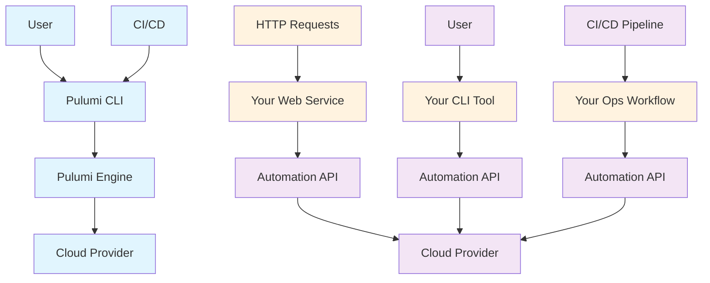

# Pulumi Architecture Patterns

This document explains the architectural differences between traditional Pulumi CLI usage and the Automation API approach.

## Architecture Diagram



## Pattern Comparison

### Traditional CLI Pattern (Left Side)

**Flow:** User/CI/CD → Pulumi CLI → Pulumi Engine → Cloud

**Characteristics:**
- Direct CLI interaction
- Static infrastructure definitions in files
- Manual or scripted deployment
- Limited runtime customization
- Standard Pulumi workflow

**Use Cases:**
- Development and testing
- Simple infrastructure deployments
- Learning Pulumi concepts
- Infrastructure as code in version control

**Commands:**
```bash
pulumi up
pulumi preview  
pulumi destroy
pulumi stack select
```

### Automation API Pattern (Right Side)

**Flow:** Various Interfaces → Your Code → Automation API → Cloud

**Three Integration Patterns:**

#### 1. Web Service Integration
**Flow:** HTTP → Web Service → Automation API → Cloud

- REST/GraphQL APIs for infrastructure management
- Multi-tenant infrastructure provisioning
- Self-service infrastructure portals
- Infrastructure as a service platforms

#### 2. Custom CLI Tools
**Flow:** User → Your CLI → Automation API → Cloud

- Domain-specific command interfaces
- Simplified user experiences
- Custom workflows and validations
- Integration with existing toolchains

#### 3. Operations Workflows
**Flow:** CI/CD → Ops Workflow → Automation API → Cloud

- Advanced deployment pipelines
- Multi-environment orchestration
- Policy-driven deployments
- Integration with external systems

## Implementation Examples

### 1. Web Service (FastAPI)

```python
from fastapi import FastAPI
import pulumi.automation as auto

app = FastAPI()

@app.post("/deploy")
async def deploy_infrastructure(request: DeploymentRequest):
    stack = auto.create_or_select_stack(
        stack_name=f"{request.app_name}-{request.env}",
        program=lambda: create_infrastructure(request)
    )
    result = await stack.up()
    return {"status": "deployed", "outputs": await stack.outputs()}
```

### 2. Custom CLI

```python
import click
import pulumi.automation as auto

@click.command()
@click.argument('environment') 
@click.argument('app_name')
def create_env(environment, app_name):
    """Create a new environment"""
    stack = auto.create_or_select_stack(
        stack_name=f"{app_name}-{environment}",
        program=lambda: create_environment_infrastructure(environment, app_name)
    )
    result = asyncio.run(stack.up())
    click.echo(f"Environment {environment} created successfully!")
```

### 3. CI/CD Workflow

```python
class DeploymentPipeline:
    async def deploy_to_environments(self, app_name: str):
        environments = ["dev", "staging", "prod"]
        
        for env in environments:
            stack = auto.create_or_select_stack(
                stack_name=f"{app_name}-{env}",
                program=lambda: create_env_specific_infrastructure(env, app_name)
            )
            
            # Environment-specific policies and configurations
            if env == "prod":
                await self.apply_production_policies(stack)
            
            result = await stack.up()
            await self.run_post_deployment_tests(env, result)
```

## Key Advantages of Automation API

### Programmatic Control
- **Runtime Configuration**: Dynamic infrastructure based on conditions
- **Custom Logic**: Business rules and validations
- **Integration**: Connect with databases, APIs, external systems

### User Experience
- **Simplified Interfaces**: Hide Pulumi complexity
- **Domain-Specific**: Tailored to specific use cases
- **Self-Service**: Enable users without Pulumi knowledge

### Operations
- **Advanced Workflows**: Multi-step deployment processes
- **Policy Enforcement**: Automated compliance checking
- **Monitoring Integration**: Connect with observability tools

### Scalability
- **Multi-Tenancy**: Manage infrastructure for multiple clients
- **Concurrent Operations**: Parallel deployments
- **Resource Optimization**: Efficient resource management

## When to Use Each Pattern

### Traditional CLI
✅ **Good for:**
- Learning Pulumi
- Simple deployments
- Development and testing
- Infrastructure templates

❌ **Not ideal for:**
- Complex user workflows
- Multi-tenant scenarios
- Custom business logic
- Advanced orchestration

### Automation API
✅ **Good for:**
- Custom user interfaces
- Integration with existing systems
- Advanced deployment workflows
- Multi-tenant infrastructure
- Self-service platforms

❌ **Not ideal for:**
- Simple, one-off deployments
- Learning basic Pulumi concepts
- Quick prototyping

## Real-World Use Cases

### 1. SaaS Platform Infrastructure
```
Customer Signup → Web API → Automation API → Customer Environment
```
- Automatic tenant provisioning
- Custom resource configurations per customer
- Billing integration based on resources

### 2. Developer Self-Service
```
Developer → Internal CLI → Automation API → Dev Environment
```
- Simplified environment creation
- Standardized configurations
- Resource quotas and policies

### 3. GitOps Deployment
```
Git Push → CI/CD → Automation API → Infrastructure Update
```
- Infrastructure changes via pull requests
- Automated testing and validation
- Progressive deployments across environments

### 4. Infrastructure Marketplace
```
Portal UI → Backend Service → Automation API → Infrastructure Templates
```
- Catalog of infrastructure patterns
- One-click deployment
- Resource governance and policies

## Getting Started

1. **Explore Traditional Pattern**: Start with basic Pulumi CLI
2. **Identify Use Case**: Determine if Automation API adds value
3. **Build Simple Integration**: Create a basic web service or CLI
4. **Add Business Logic**: Implement custom workflows and validations
5. **Scale Up**: Add multi-tenancy, advanced orchestration

## Resources

- [Pulumi Automation API Documentation](https://www.pulumi.com/docs/iac/automation-api/)
- [Architecture Patterns Example](./architecture-patterns.py)
- [Enhanced Automation API Demo](./README.md)

The key insight is that Automation API transforms Pulumi from a CLI tool into a programmable infrastructure SDK, enabling sophisticated integration patterns that wouldn't be possible with traditional CLI usage alone.