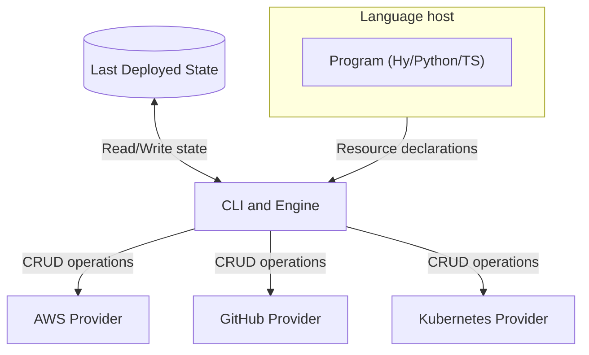

# Pulumi Architecture

## How Pulumi Works

Based on https://www.pulumi.com/docs/iac/concepts/how-pulumi-works/

### Core Components

1. **State Storage**: Tracks last deployed state
2. **CLI and Engine**: Core orchestration 
3. **Language Host**: Executes program (index.js, __main__.py, etc)
4. **Resource Providers**: Interface with cloud APIs

### Execution Flow

### Key Concepts

- **Declarative**: Describe desired state, Pulumi handles transitions
- **Language-native**: Use real programming languages (Python, TypeScript, Go, etc)
- **State Management**: Automatic tracking of resource dependencies
- **Preview**: See changes before applying them

### Our Hy Integration

Using Hy (Lisp for Python) provides:
- S-expression syntax for infrastructure
- Macro capabilities for abstraction
- Full Python ecosystem access
- Functional programming patterns